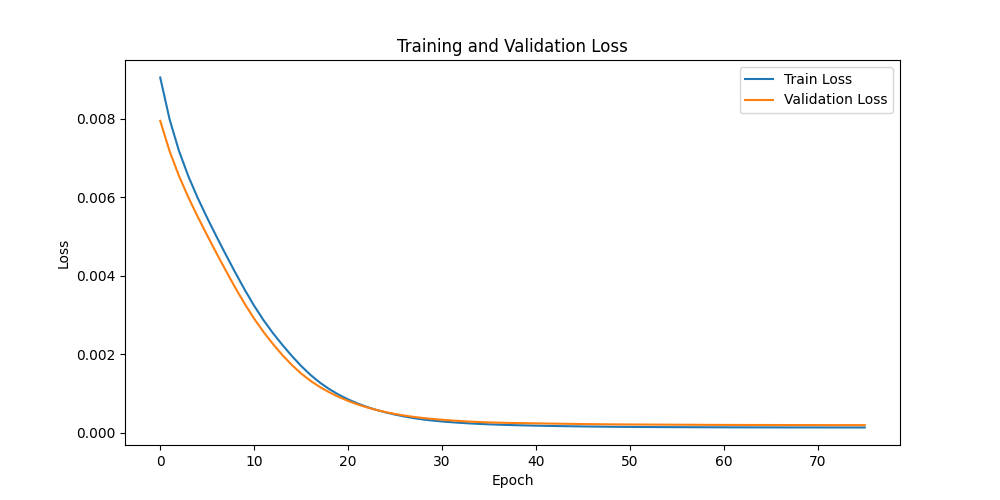
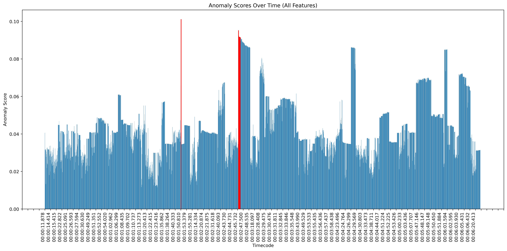
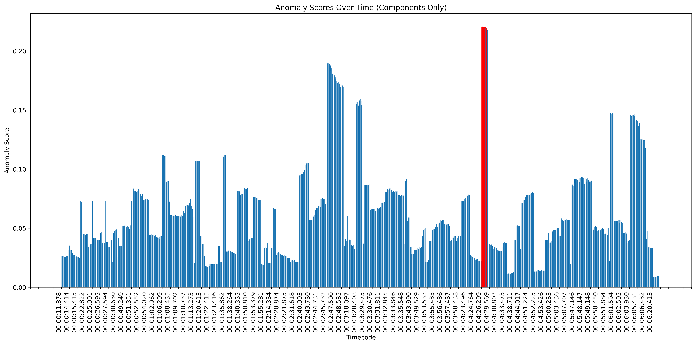
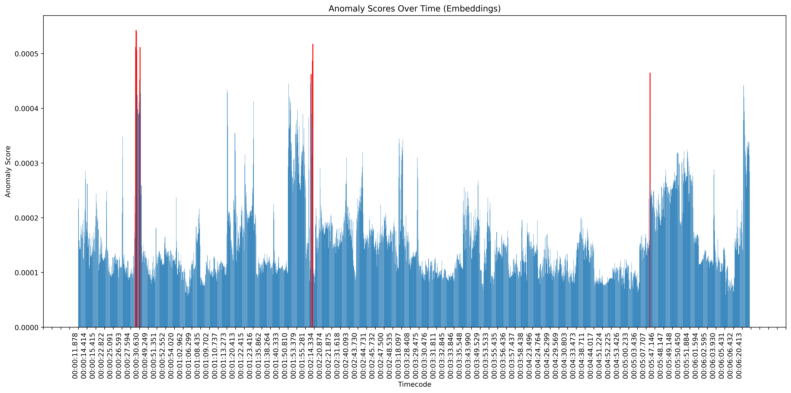
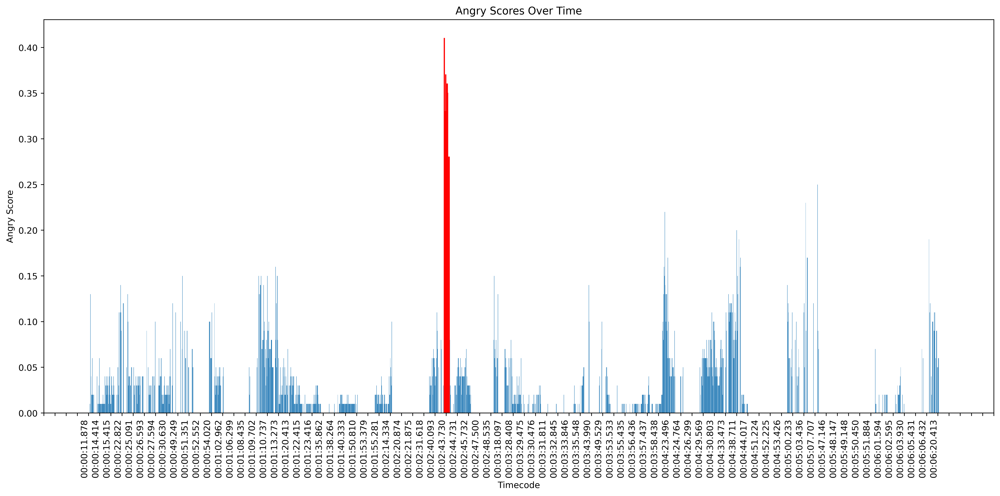
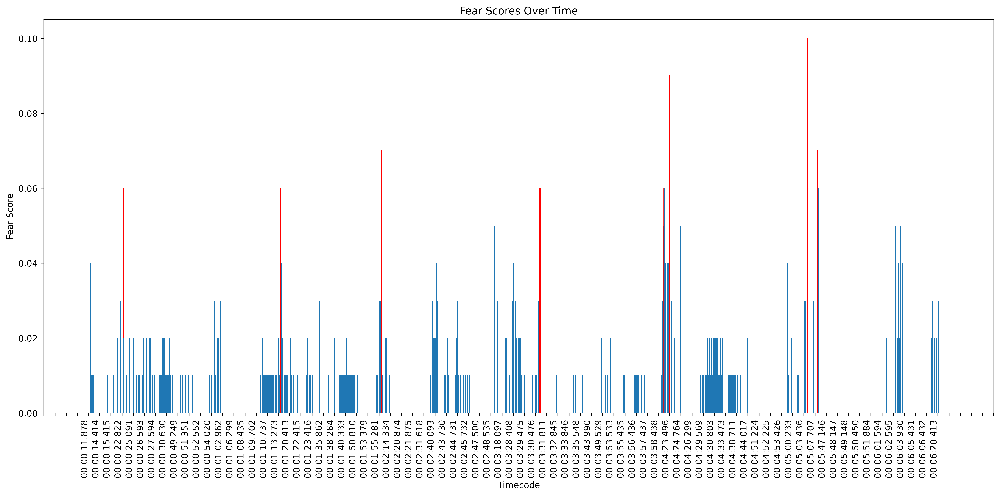
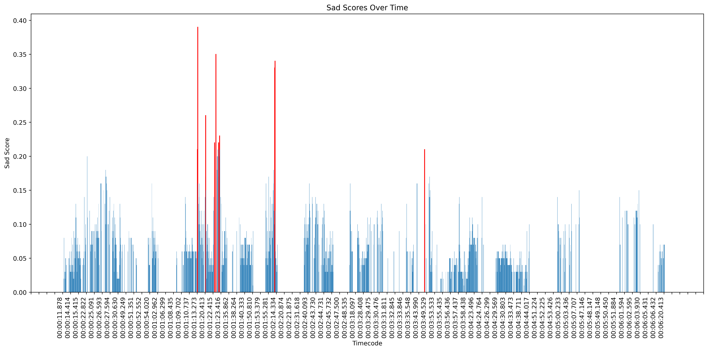

# Facial-Expression-Anomality-Detection

This repository contains an algorithm for detecting anomalies in facial expressions over the timeline of a video using time series analysis, specifically utilizing an LSTM autoencoder.

The tool extracts faces from video frames, detects unique facial features, and analyzes emotional facial expression to identify anomalies. This is particularly useful for forensic analysis and human intelligence (HUMINT) operations.

## Practical Applications
### Forensic Analysis
- Identify suspicious behavior in surveillance footage.
- Detect stress or duress in interrogation videos.

### Human Intelligence (HUMINT)
- Analyze micro-expressions.
- Monitor and assess emotional states in communications.

## Key Features
- **Face Extraction**: Extracts faces from video frames.
- **Face Alignment**: Aligns and normalizes faces.
- **Feature Embeddings**: Extracts facial feature embeddings using the InceptionResnetV1/VGG-Face model.
- **Emotion Detection**: Identifies facial expressions and categorizes emotions.
- **Anomaly Detection**: Uses an LSTM autoencoder to detect anomalies in facial expressions.

## Micro-Expressions
Paul Ekman’s work on facial expressions of emotion identified universal micro-expressions that reveal true emotions. These fleeting expressions, which last only milliseconds, are incredibly difficult for humans to detect but can be captured and analyzed using computer vision algorithms. 

## InceptionResnetV1
The InceptionResnetV1 model is a deep convolutional neural network. It is widely used for facial recognition and facial attributes extraction. 
- **Accuracy and Reliability**: The InceptionResnetV1 model is pre-trained on the VGGFace2 dataset, which consists of millions of facial images. It achieves very high accuracy in recognizing and differentiating between faces.
- **Feature Richness**: The embeddings generated by InceptionResnetV1 capture rich facial details, which are essential for recognizing subtle expressions and variations.
- **Global Recognition**: This model is widely adopted in various facial recognition applications, demonstrating its reliability and robustness across different scenarios.

## FER
The Facial Expression Recognition (FER) model used in our pipeline is a pre-trained neural network designed to identify emotional states from facial expressions. Key details about the FER model include:

- **Accuracy and Reliability**: The FER model is pre-trained on a large dataset of facial images labeled with emotional states, achieving high accuracy in identifying seven basic emotions: Anger, Disgust, Fear, Happiness, Sadness, Surprise, and Neutral.
- **Robustness**: The model is capable of recognizing emotions in varying lighting conditions, facial orientations, and occlusions, making it highly reliable for practical applications.

## LSTM Autoencoder

An LSTM (Long Short-Term Memory) Autoencoder is a neural network designed for sequential data. It consists of an encoder that compresses input sequences into a fixed-length representation and a decoder that reconstructs the sequence from this representation. 

In our facial-expression anomaly detection:

1. **Input Preparation**: Facial embeddings are extracted from video frames.
2. **Sequence Creation**: These embeddings form a chronological sequence.
3. **Training**: The LSTM autoencoder learns typical patterns in these sequences.
4. **Anomaly Detection**: High reconstruction errors highlight frames with unusual facial expressions, indicating potential anomalies.

This approach effectively captures temporal dependencies and subtle changes in facial expressions, providing robust anomaly detection.

In our facial-expression anomaly detection, we leverage the LSTM autoencoder in three different ways:

1. **Using All Features**:
   - We consider the feature's components and emotion scores as input features.
   - The LSTM autoencoder is trained to detect anomalies based on the full set of features.

2. **Using Reduced Components**:
   - We use UMAP (Uniform Manifold Approximation and Projection) to reduce the dimensionality of the facial embeddings into N components.
   - These reduced components are then used as input for the LSTM autoencoder to detect anomalies based on the compressed feature set.

3. **Using Full-Dimensional Embeddings**:
   - The raw facial embeddings, without any dimensionality reduction, are used directly.
   - The LSTM autoencoder is trained on these high-dimensional embeddings to identify anomalies.

Each method provides a different perspective on the data, enhancing our capability to detect subtle and varied anomalies in facial expressions.

## An Example from a Death Sentence Verdict

Wade Wilson, a 30-year-old from Fort Myers, Florida, was convicted in June 2024 for the October 2019 murders of Kristine Melton and Diane Ruiz in Cape Coral. During the trial, Wilson was notably cold and calm, displaying a "smug, soulless" demeanor that drew significant attention. He showed a lack of emotion throughout the proceedings, which many found unsettling. The jury recommended the death penalty, with the final sentencing set for July 23, 2024.

  
Sources:   
[1] https://www.foxnews.com/us/florida-double-murderer-viral-smug-soulless-courtroom-demeanor   
[2] https://winknews.com/2024/06/13/wade-wilsons-lack-emotion-double-murder-trial/   
[3] https://www.youtube.com/watch?v=8j8psgKXmRg

### LSTM Autoencoder Learning Curve

### Detected Anomalies (Facial Features)

### Detected Anomalies (Emotions)

### Results and Observations
The anomaly detection results highlighted significant anomalies primarily during time points where the penalty of death was discussed during Wade Wilson's trial. Despite Wilson's cold and detached demeanor to human eyes, the LSTM autoencoder detected subtle emotional leaks through his facial expressions. These insights suggest that critical moments, such as mentions of the death penalty, had a marked impact on Wilson, which was reflected in the anomalous changes in his facial expressions.

## Setup Parameters
- `NUM_ANOMALIES`
- `DESIRED_FPS`
- `NUM_COMPONENTS`
- `batch_size`
- `VIDEO_FILE_PATH`

## Output
- Organized faces by detected persons in the `organized_faces` folder.
- Anomalies detection results as a CSV file in the project directory.

### Face Extraction and Alignment
The algorithm extracts faces from the video, aligns, and normalizes them using MediaPipe and MTCNN.

### Feature Embedding Extraction
Utilizes the InceptionResnetV1 model to extract facial features and FER to detect emotions.

### Clustering and Outlier Detection
Clusters faces to organize them by person.

### LSTM Autoencoder for Anomaly Detection
Trains an LSTM autoencoder to identify anomalies in facial expressions over time. This model helps capture temporal dependencies and irregularities in the sequence of facial expressions and feature embeddings.

### Dependencies
- `torch`
- `facenet-pytorch`
- `mediapipe`
- `FER`
- `sklearn`
- `umap-learn`
- `tqdm`
- `opencv-python`
- `scipy`
- `pandas`
- 
## Conclusion
This tool offers robust solutions for detecting emotional anomalies in video-based facial expressions, beneficial for both forensic analysis and HUMINT operations. By leveraging advanced computer vision techniques and the power of LSTM autoencoders, it provides timely and crucial insights into human behavior.
